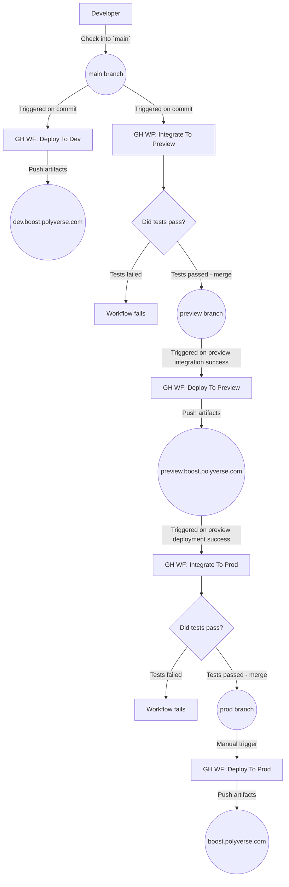

# CI/CD Workflow

This document describes the process/workflow used for CI/CD between GitHub Workflows and Vercel.

## Overview

**Last Updated:** 1/23/24

Any code committed to our trunk for development will go through this automatic CI/CD process:
* Commit code to `main`
* Build and deploy artifacts from `main` to Vercel `dev.boost.polyverse.com` domain
* Build and test code from `main`
* Merge code from `main` to `preview`
* Build and deploy artifacts from `preview` to Vercel `preview.boost.polyverse.com` domain
* Build and test code from `preview`
* Merge code from `preview` to `prod`

After the relevant code is merged into `prod` one can manually start a deployment to the Vercel `boost.polyverse.com` domain. See the section [Continuous Deployment: Deploying To Vercel](#Continuous-Deployment-Deploying-To-Vercel) for more details.

