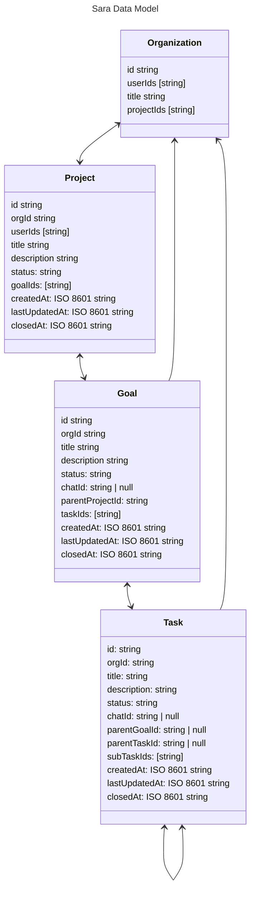

# Class Diagram (Data Model)

This doc contains class diagrams that represent the Sara data model. They are typically MermaidJS markdown that can be used here: https://mermaid.live/

## Data Model

**Last Updated:** 2/13/24

