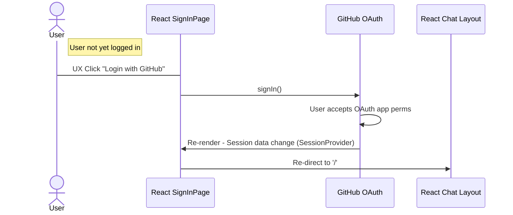
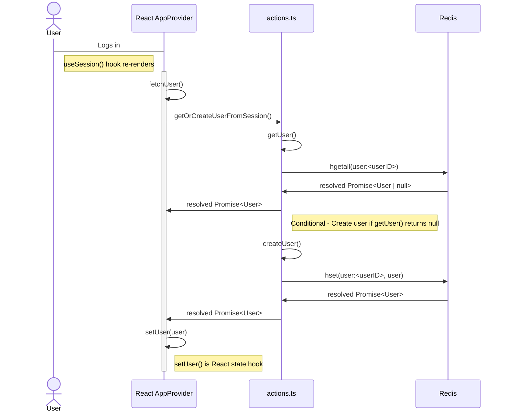
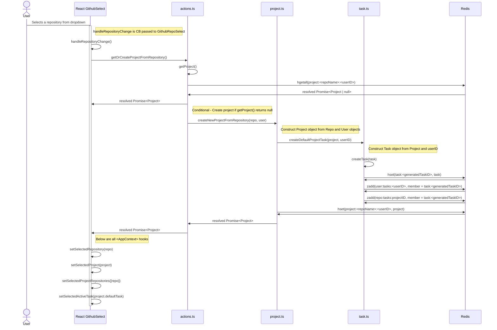
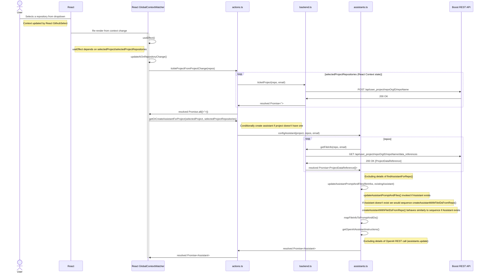
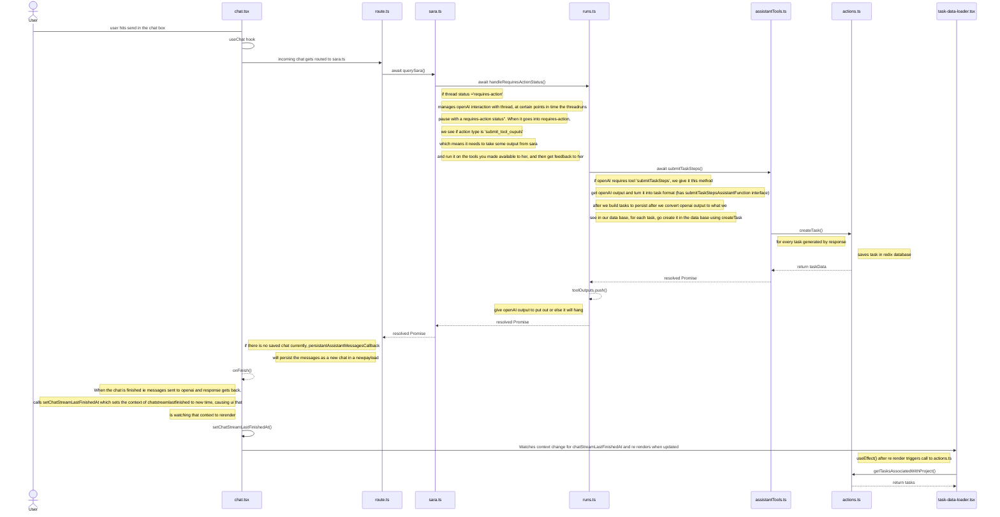

# Sequence Diagrams

- [Sequence Diagrams](#Sequence-Diagrams)
  - [User Login With GitHub Auth Provider](#User-Login-With-GitHub-Auth-Provider)
  - [`<AppProvider>` Monitors For User Session Changes](#AppProvider-Monitors-For-User-Session-Changes)
  - [User Selects Repository From Dropdown](#User-Selects-Repository-From-Dropdown)
  - [Tickling Projects & Updating OpenAI Assistant On Repository Change (Assistant Exists)](#Tickling-Projects--Updating-OpenAI-Assistant-On-Repository-Change-Assistant-Exists)

This doc contains sequence diagrams throughout Sara. They are typically MermaidJS markdown that can be used here: https://mermaid.live/

## User Login With GitHub Auth Provider

**Last Updated:** 1/18/24

## `<AppProvider>` Monitors For User Session Changes

**Last Updated:** 1/18/24

## User Selects Repository From Dropdown

**Last Updated:** 1/18/24

## Tickling Projects & Updating OpenAI Assistant On Repository Change (Assistant Exists)

**Last Updated:** 1/11/24
This diagram presumes the OpenAI Assistant already exists. A different diagram would be used for when it didn't exist.

## User Requests to Generate Tasks

**Last Updated:** 1/23/24

