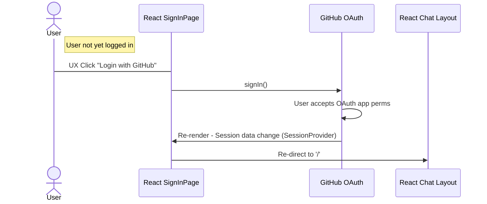
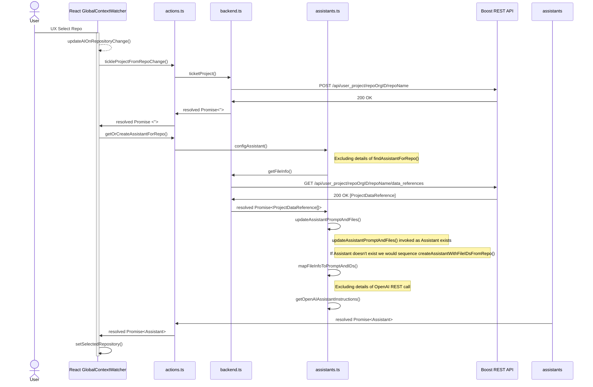

# Sequence Diagrams

This doc contains sequence diagrams throughout Sara. They are typically MermaidJS markdown that can be used here: https://mermaid.live/

## User Login

**Last Updated:** 1/18/24

## Updating OpenAI Assistant On Repository Change (Assistant Exists)

**Last Updated:** 1/11/24
This diagram presumes the OpenAI Assistant already exists. A different diagram would be used for when it didn't exist.

